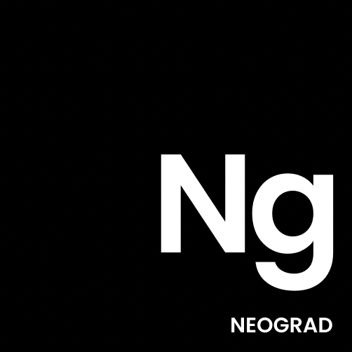

# Neograd
### A Deep Learning framework created from scratch with Python and NumPy

<br>
<div align="center">
  
</div>
<br>

[](https://github.com/pranftw/neograd/actions/workflows/python-app.yml)

## Motivation
I firmly believe that in order to understand something completely, you have to build it on your own from scratch. I used to do gradient calculation analytically, and thought that autograd was some kind of magic. So this was initially built to understand autograd but later on its scope was extended. You might be wondering, there are already many frameworks like TensorFlow and PyTorch that are very popular, and why did I have to create another one? The answer is that these have very complex codebases that are difficult to grasp. So I intend that this repository be used as an educational tool in order to understand how things work under the hood in these giant frameworks, with code that is intuitive and easily readable.

## Installation
`pip install neograd`

## Features
### Automatic Differentiation
`autograd` offers automatic differentiation for vectors of any dimension
```
import neograd as ng
a = ng.tensor(3, requires_grad=True)
b = ng.tensor([1,2,3], requires_grad=True)
c = a+b
c.backward([1,1,1])
```
### Optimized Memory Usage
During the forward pass, a `graph` is created for the backward pass, as soon as the Tensor's gradient is calculated and all its parents have used its gradients to calculate their own, the Tensor is automatically flushed from the memory using `auto-removal`
### PyTorch like API
PyTorch's API is one of the best and one the most elegant API designs, so we've leveraged the same
### Neural Network Module
`nn` contains some of the most commonly used optimizers, activations and loss functions required to train a Neural Network
### Modular
Custom `Layer` can be created hence providing more flexibility and personalization to create basically anything you want
### Custom autograd operations
If you wanted a custom operation to have `autograd` capabilities, those can be defined with very simple interface each having a forward method and a backward method

## Example
```
import neograd as ng
import numpy as np
from neograd.nn.loss import BCE
from neograd.nn.optim import GD
from sklearn.datasets import make_circles
from sklearn.model_selection import train_test_split

X, y = make_circles(n_samples=1000, noise=0.05, random_state=100)
X_train, X_test, y_train, y_test = train_test_split(X,y)

X_train, X_test = ng.tensor(X_train.T), ng.tensor(X_test.T)
y_train, y_test = ng.tensor(y_train.T.reshape(1,750)), ng.tensor(y_test.T.reshape(1,250))

num_train = 750
num_test = 250
num_iter = 1000

class NN(ng.nn.Model):
  def __init__(self):
    super().__init__(self)
    self.stack = ng.nn.Sequential(
      ng.nn.Linear(2,10),
      ng.nn.ReLU(),
      ng.nn.Linear(10,1),
      ng.nn.Sigmoid()
    )
  
  def forward(self, inputs):
    return self.stack(inputs)

model = NN()
loss_fn = BCE()
optim = GD(model.get_params(), 0.15)

for iter in range(num_iter):
  optim.zero_grad()
  outputs = model(X_train)
  loss = loss_fn(outputs, y_train)
  loss.backward()
  optim.step()
  if iter%50==0:
    print(f"iter {iter+1}/{num_iter}\nloss: {loss}\n")
```

## Resources
- A big thank you to Andrej Karpathy for his CS231n lecture on Backpropagation which was instrumental in helping me gain a good grasp of the basic mechanisms of autograd
[Lecture](https://youtu.be/i94OvYb6noo)
- Thanks to Terance Parr and Jeremy Howard for their paper The Matrix Calculus You Need For Deep Learning which helped me get rid of my fear for matrix calculus, that is beautifully written starting from the very fundamentals and slowly transitioning into advanced topics
[Paper](https://arxiv.org/abs/1802.01528)